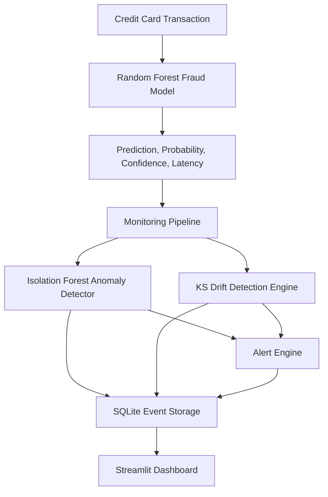

# Sentinel-NET

AI Anomaly Detection & Model Monitoring System for a credit-card fraud model.

## Overview

Sentinel-NET monitors a Random Forest fraud classifier and records inference
latency, fraud probability, confidence, CPU usage, memory usage, request rate,
Isolation Forest anomaly scores, drift status, and alerts.

## Problem Statement

Fraud models can degrade after deployment because traffic changes, data quality
shifts, infrastructure slows down, or prediction confidence collapses. Accuracy
alone is especially misleading for fraud detection because legitimate
transactions dominate the data.

## Architecture



## Core Features

- ULB `creditcard.csv` schema validation and stratified train/test split.
- Random Forest fraud classifier with class weighting.
- Precision, recall, F1, ROC-AUC, PR-AUC, confusion matrix, and false-positive rate.
- Real monitoring events from model inference, not random dashboard metrics.
- Isolation Forest monitoring detector over probability, confidence, latency, CPU, memory, and request rate.
- Percentile-normalized live anomaly score in `[0, 1]`.
- KS-test drift detection with Benjamini-Hochberg correction.
- SQLite storage for monitoring events, drift events, and alerts.
- Streamlit dashboard with simulation controls and controlled anomaly/drift injection.

## Dataset

Download the ULB Credit Card Fraud Detection dataset from Kaggle and place it at:

```bash
datasets/creditcard.csv
```

Expected columns are `Time`, `V1` through `V28`, `Amount`, and `Class`.
`Class=0` means legitimate and `Class=1` means fraudulent. The dataset file is
ignored by Git.

## Installation

```bash
python -m venv .venv
.venv\Scripts\activate
pip install -r requirements.txt
```

## Training

```bash
python scripts/train_fraud_model.py
python scripts/train_anomaly_detector.py
python scripts/evaluate_anomaly_detector.py
```

The fraud model writes `artifacts/random_forest.pkl` and
`artifacts/model_metrics.json`. The anomaly evaluation writes
`config/anomaly_config.json`.

## Running

```bash
streamlit run app.py
```

The dashboard can run in demo mode before the ULB dataset is downloaded, but
the reported Random Forest metrics are only available after training on the real
dataset.

## Testing

```bash
pytest
```

## Live Anomaly Score

Isolation Forest `decision_function` returns higher values for more normal
events and lower values for more abnormal events. Sentinel-NET stores the 5th
and 95th percentile of baseline decision scores and maps each new score with:

```text
severity = (baseline_q95 - score) / (baseline_q95 - baseline_q05)
```

The result is clipped to `[0, 1]`, where `0` is normal and `1` is highly
anomalous.

## Drift Detection

Feature drift compares the reference transaction distribution with the current
rolling window using `scipy.stats.ks_2samp`. P-values are corrected with
Benjamini-Hochberg false discovery rate control. Prediction drift and confidence
drift compare their respective reference and current windows with the same KS
test.

## Evaluation Metrics

Generated on the local ULB dataset with `python scripts/train_fraud_model.py`:

- Precision: `0.9383`
- Recall: `0.7755`
- F1: `0.8492`
- ROC-AUC: `0.9617`
- PR-AUC: `0.8534`
- False-positive rate: `0.0000879`
- Confusion matrix: TN `56859`, FP `5`, FN `22`, TP `76`

Generated by `python scripts/evaluate_anomaly_detector.py` on controlled
monitoring scenarios:

- Selected contamination: `0.01`
- Test precision: `0.7037`
- Test recall: `0.0950`
- Test F1: `0.1674`
- Test false-positive rate: `0.0160`

The anomaly detector is tuned for low false positives on this controlled
simulation, but recall is limited and should be improved before relying on it
outside a demo.

## Project Structure

```text
app.py
src/
  alerts/
  anomaly/
  data/
  drift/
  evaluation/
  models/
  monitoring/
  storage/
scripts/
config/
artifacts/
datasets/
tests/
docs/
```

## Limitations

- Controlled anomaly scenarios are demonstrations, not production incidents.
- KS drift detection catches distribution shifts, not every kind of concept drift.
- The dashboard demo fallback is synthetic and exists only so the app can be explored without the large dataset.
- The cloned repository did not include a license file; see `NOTICE.md`.
